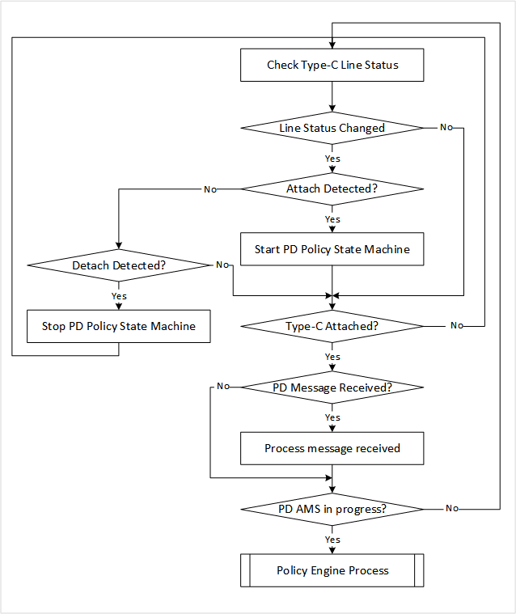
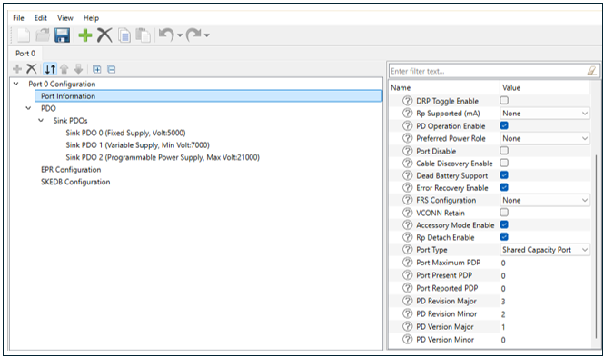
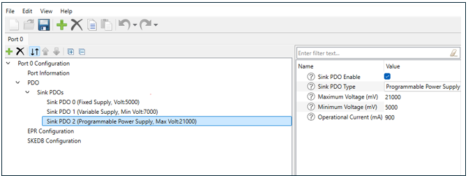
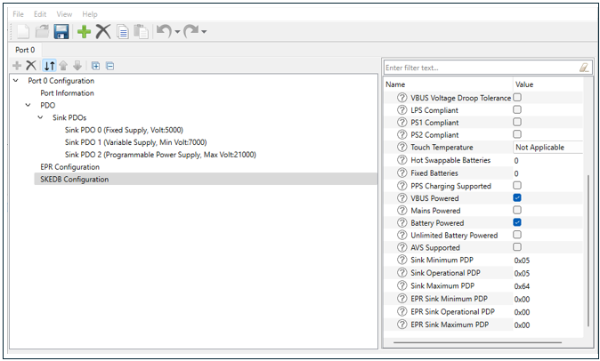

# EZ-PD&trade; PMG1 MCU: USB PD sink PPS demo

This code example illustrates how to implement a programmable power supply (PPS) sink using the EZ-PD&trade; PMG1 MCU devices. 

The EZ-PD&trade; PMG1 MCU establishes a PPS sink contract with a USB-C power adapter capable of PPS, and the device subsequently requests a voltage range from the minimum to maximum VBUS voltage supported by the adjustable power delivery object (APDO). This voltage is adjusted in increments of 100 mV, starting with the minimum advertised current. When the device reaches the maximum VBUS voltage, it begins to decrease the voltage in 100 mV steps until it reaches the minimum voltage, while maintaining the minimum current.

[View this README on GitHub.](https://github.com/Infineon/mtb-example-pmg1-usbpd-sink-pps)

[Provide feedback on this code example.](https://github.com/Infineon/mtb-example-pmg1-usbpd-sink-pps)

## Requirements

- [ModusToolbox&trade;](https://www.infineon.com/modustoolbox) v3.1 or later (tested with v3.1)
- Board support package (BSP) minimum required version: 3.1.0
- Programming language: C
- Associated parts: All [EZ-PD&trade; PMG1 MCU](https://www.infineon.com/PMG1) parts
- PPS capable USB-C adapter
- (Optional) Multimeter / PD analyzer / oscilloscope to observe the USB PD supply voltage VBUS

## Supported toolchains (make variable 'TOOLCHAIN')

- GNU Arm&reg; Embedded Compiler v11.3.1 (`GCC_ARM`) - Default value of `TOOLCHAIN`
- Arm&reg; Compiler v6.16 (`ARM`)
- IAR C/C++ Compiler v9.30.1 (`IAR`)

## Supported kits (make variable 'TARGET')

- [EZ-PD&trade; PMG1-S0 Prototyping Kit](https://www.infineon.com/CY7110) (`PMG1-CY7110`) - Default value of `TARGET`
- [EZ-PD&trade; PMG1-S1 Prototyping Kit](https://www.infineon.com/CY7111) (`PMG1-CY7111`)
- [EZ-PD&trade; PMG1-S2 Prototyping Kit](https://www.infineon.com/CY7112) (`PMG1-CY7112`)
- [EZ-PD&trade; PMG1-S3 Prototyping Kit](https://www.infineon.com/CY7113) (`PMG1-CY7113`)

## Hardware setup

This example uses the board's default configuration. See the kit user guide to ensure that the board is configured correctly.

1. Connect the board to your PC using the USB cable through the KitProg3 Type-C connector (J1). This cable is used for programming and debugging the EZ-PD&trade; PMG1 device.

2. Connect the USB PD port to the PPS capable USB-C power adapter using the USB Type-C cable. This cable is used for the USB power delivery source and it provides power to the user LED.

## Software setup

Install a terminal emulator if you don't have one. Instructions in this document use [Tera Term](https://ttssh2.osdn.jp/index.html.en).

This example requires no additional software or tools.

## Using the code example

### Create the project

The ModusToolbox&trade; tools package provides the Project Creator as both a GUI tool and a command line tool.

<details><summary><b>Use Project Creator GUI</b></summary>

1. Open the Project Creator GUI tool.
   There are several ways to do this, including launching it from the dashboard or from inside the Eclipse IDE. For more details, see the [Project Creator user guide](https://www.infineon.com/ModusToolboxProjectCreator) (locally available at *{ModusToolbox&trade; install directory}/tools_{version}/project-creator/docs/project-creator.pdf*).
 
2. On the **Choose Board Support Package (BSP)** page, select a kit supported by this code example. See [Supported kits](#supported-kits-make-variable-target).

 > **Note:** To use this code example for a kit not listed here, you may need to update the source files. If the kit does not have the required resources, the application may not work.

3. On the **Select Application** page:
   a. Select the **Applications(s) Root Path** and the **Target IDE**.
 > **Note:** Depending on how you open the Project Creator tool, these fields may be pre-selected for you.
 
   b.	Select this code example from the list by enabling its check box.
 > **Note:** You can narrow the list of displayed examples by typing in the filter box.
 
   c. (Optional) Change the suggested **New Application Name** and **New BSP Name**.
 
   d. Click **Create** to complete the application creation process.
</details>

<details><summary><b>Use Project Creator CLI</b></summary>

The 'project-creator-cli' tool can be used to create applications from a CLI terminal or from within batch files or shell scripts. This tool is available in the *{ModusToolbox&trade; install directory}/tools_{version}/project-creator/* directory.

Use a CLI terminal to invoke the 'project-creator-cli' tool. On Windows, use the command-line 'modus-shell' program provided in the ModusToolbox&trade; installation instead of a standard Windows command-line application. This shell provides access to all ModusToolbox&trade; tools. You can access it by typing "modus-shell" in the search box in the Windows menu. In Linux and macOS, you can use any terminal application.

The following example clones the "[USB PD Sink PPS Demo](https://github.com/Infineon/mtb-example-pmg1-usbpd-sink-pps)" application with the desired name "MyUsbPdSinkPPSDemo" configured for the *PMG1-CY7110* BSP into the specified working directory, *C:/mtb_projects*:
 ```
 project-creator-cli --board-id PMG1-CY7110 --app-id mtb-example-pmg1-usbpd-sink-pps --user-app-name MyUsbPdSinkPPSDemo --target-dir "C:/mtb_projects"
 ```
 
The 'project-creator-cli' tool has the following arguments:

Argument | Description | Required/optional
---------|-------------|-----------
`--board-id` | Defined in the <id> field of the [BSP](https://github.com/Infineon?q=bsp-manifest&type=&language=&sort=) manifest | Required
`--app-id` | Defined in the <id> field of the [CE](https://github.com/Infineon?q=ce-manifest&type=&language=&sort=) manifest | Required
`--target-dir`| Specify the directory in which the application is to be created if you prefer not to use the default current working directory | Optional
`--user-app-name`| Specify the name of the application if you prefer to have a name other than the example's default name | Optional

> **Note:** The project-creator-cli tool uses the `git clone` and `make getlibs` commands to fetch the repository and import the required libraries. For details, see the "Project creator tools" section of the [ModusToolbox&trade; tools package user guide](https://www.infineon.com/ModusToolboxUserGuide) (locally available at {ModusToolbox&trade; install directory}/docs_{version}/mtb_user_guide.pdf).
</details>

### Open the project

After the project has been created, you can open it in your preferred development environment.

<details><summary><b>Eclipse IDE</b></summary>

If you opened the Project Creator tool from the included Eclipse IDE, the project will open in Eclipse automatically.
For more details, see the [Eclipse IDE for ModusToolbox&trade; user guide](https://www.infineon.com/MTBEclipseIDEUserGuide) (locally available at *{ModusToolbox&trade; install directory}/docs_{version}/mt_ide_user_guide.pdf*).

</details>

<details><summary><b>Visual Studio (VS) Code</b></summary>

Launch VS Code manually, and then open the generated *{project-name}.code-workspace* file located in the project directory.
For more details, see the [Visual Studio Code for ModusToolbox&trade; user guide](https://www.infineon.com/MTBVSCodeUserGuide) (locally available at *{ModusToolbox&trade; install directory}/docs_{version}/mt_vscode_user_guide.pdf*).

</details>

<details><summary><b>Keil µVision</b></summary>

Double-click the generated *{project-name}.cprj* file to launch the Keil µVision IDE.
For more details, see the [Keil µVision for ModusToolbox&trade; user guide](https://www.infineon.com/MTBuVisionUserGuide) (locally available at *{ModusToolbox&trade; install directory}/docs_{version}/mt_uvision_user_guide.pdf*).

</details>

<details><summary><b>IAR Embedded Workbench</b></summary>

Open IAR Embedded Workbench manually, and create a new project. Then select the generated *{project-name}.ipcf* file located in the project directory.
For more details, see the [IAR Embedded Workbench for ModusToolbox&trade; user guide](https://www.infineon.com/MTBIARUserGuide) (locally available at *{ModusToolbox&trade; install directory}/docs_{version}/mt_iar_user_guide.pdf*).

</details>

<details><summary><b>Command line</b></summary>

If you prefer to use the CLI, open the appropriate terminal, and navigate to the project directory. On Windows, use the command-line 'modus-shell' program; on Linux and macOS, you can use any terminal application. From there, you can run various `make` commands.
For more details, see the [ModusToolbox&trade; tools package user guide](https://www.infineon.com/ModusToolboxUserGuide) (locally available at *{ModusToolbox&trade; install directory}/docs_{version}/mtb_user_guide.pdf*).

</details>

## Operation

1. Ensure that the steps listed in the [Hardware setup](#hardware-setup) section are complete.

2. Ensure that the jumper shunt on power selection jumper (J5) is placed at position 2-3 (VIN) while programming the kit.

3. Program the board using one of the following:

   <details><summary><b>Using Eclipse IDE for ModusToolbox&trade;</b></summary>

      1. Select the application project in the Project Explorer.

      2. In the **Quick Panel**, scroll down, and click **\<Application Name> Program (KitProg3_MiniProg4)**.
   </details>

   <details><summary><b>Using CLI</b></summary>

     From the terminal, execute the `make program` command to build and program the application using the default toolchain to the default target. The default toolchain and target are specified in the application's Makefile but you can override those values manually:
      ```
      make program TOOLCHAIN=<toolchain>
      ```

      Example:
      ```
      make program TOOLCHAIN=GCC_ARM
      ```
   </details>

4. After programming the kit, change the position on power selection jumper (J5) to 1-2 (VBUS).

5. Connect a PPS source to USB PD Port (J10).

6. EZ-PD&trade; PMG1 device (sink) reads the source capabilities advertised by the PPS source and parses the programmable power supply (PPS) power data object (PDO)s and finds out the minimum voltage, maximum voltage and minimum current

7. EZ-PD&trade; PMG1 device (sink) makes a contract with the PDOs which offers higher power. 

8. If source is capable of supporting PPS, 
  
	- After 1 second, EZ-PD&trade; PMG1 device (sink) makes a PPS 5V contract with the PPS source. Negotiated voltage can be measured across the DC_OUT terminal (J9) using the multimeter or oscilloscope.
	- If PPS contract is made, user LED blinks at about 1Hz (toggles every 500ms). 
	- EZ-PD&trade; PMG1 device (sink) starts requesting for PPS minimum voltage with minimum current to the PPS source after 500 ms.
	- EZ-PD&trade; PMG1 device (sink) renegotiates with an incremental voltage in steps of 100 mV with minimum current for every 500 ms.
	- After voltage reaches maximum, EZ-PD&trade; PMG1 device (sink) renegotiates with a decremental voltage in steps of 100 mV with minimum current for every 500 ms.
	- After voltage reaches minimum, EZ-PD&trade; PMG1 device (sink) renegotiates with an incremental voltage. This happens in loop.

    **Figure 1. Voltage graph**

    
<br>

9. If the source does not support PPS. User LED glows indicating that PPS contract is not made. 

10. Pressing user switch sends "Get_PPS_Status" PD message to PPS source. PPS source replies with "PPS_Status" PD message to EZ-PD&trade; PMG1 MCU device (sink). PD packets can be seen using [EZ-PD&trade; Protocol Analyzer](https://www.infineon.com/cms/en/product/evaluation-boards/cy4500/).

**Note:** The CY4500 EZ-PD™ Protocol Analyzer tool records traffic passively on the Configuration Channel (CC) and allows users to analyze and debug USB Power Delivery communication. The low-cost and compact CY4500 EZ-PD™ Protocol Analyzer acts as a pass-through for VBUS, VCONN, USB 3.1, USB 2.0 and USB-PD traffic.


## Debugging

You can debug the example to step through the code.

<details><summary><b>In Eclipse IDE</b></summary>

Use the **\<Application Name> Debug (KitProg3_MiniProg4)** configuration in the **Quick Panel**. 

Ensure that the board is connected to your PC using the USB cables through both the KitProg3 USB connector as well as the USB PD port, with the jumper shunt on power selection jumper (J5) placed at position 1-2.
For details, see the "Program and debug" section in the [Eclipse IDE for ModusToolbox&trade; user guide](https://www.infineon.com/MTBEclipseIDEUserGuide).

</details>

<details><summary><b>In other IDEs</b></summary>

Follow the instructions in your preferred IDE.

</details>

## Design and implementation

EZ-PD&trade; PMG1 MCU devices support a USB PD block which integrates Type-C terminations, comparators, and the Power Delivery transceiver required to detect the attachment of a partner device and negotiate power contracts with it.

On reset, the USB PD block is initialized with the following settings:

 - The receiver clock input of the block is connected to a 12-MHz PERI-derived clock.
 
 - The transmitter clock input of the block is connected to a 600-kHz PERI-derived clock.
 
 - The SAR ADC clock input of the block is connected to a 1-MHz PERI-derived clock.
 
 - The SAR ADC in the USB PD block is configured to measure the VBUS_TYPE-C voltage through an internal divider.
 
This application uses the PDStack middleware library in an upstream facing port (UFP) - sink configuration. EZ-PD&trade; PMG1 MCU devices have a dead-battery Rd termination, which ensures that a USB-C source/charger connected to it can detect the presence of a sink even when the EZ-PD&trade; PMG1 MCU device is not powered.

**Figure 2. Firmware flowchart**


<br>

The PDStack middleware library configures the USB PD block on the EZ-PD&trade; PMG1 MCU device to detect Type-C connection state changes and USB PD messages, and notify the stack through callback functions. The callback function registers the pending tasks, which are then handled by PDStack through the `Cy_PdStack_Dpm_Task` function. This function is expected to be called at appropriate times from the main processing loop of the application.

**Figure 3. PDStack task flowchart**


<br>

The PDStack middleware library implements the state machines defined in the [USB Type-C Cable and Connector](https://www.usb.org/document-library/usb-type-cr-cable-and-connector-specification-revision-20) and the [USB Power Delivery](https://www.usb.org/document-library/usb-power-delivery) specifications.

PDStack consists of the following main modules:

-  **Type-C manager:** Responsible for detecting a Type-C connection and identifying the type of connection. It uses the configurable Rp/Rd terminations provided by the USB PD block and the internal line state comparators. The Type-C manager implements the state machines defined in the *USB Type-C Cable and Connector specification* and provides the following functionality:

   - *Manage CC terminations*: Applies Rp/Rd terminations according to the port role

   -  *Attach detection*: Performs the required debounce and determines the type of device attached

   -  *Detach detection*: Monitors the CC line and VBus for detecting a device detach

-  **Protocol Layer:** Forms the messages used to communicate between a pair of ports/cable plugs. It is responsible for forming capabilities messages, requests, responses, and acknowledgements. It receives inputs from the policy engine indicating which messages to send and relays the responses back to the policy engine.

-  **Policy engine:** Provides a mechanism to monitor and control the USB Power Delivery system within a particular consumer, provider, or cable plug. It implements the state machines defined in the *USB Power Delivery* specification and contains implementations of all PD atomic message sequences (AMS). It interfaces with the protocol layer for PD message transmission/reception for controlling the reception of message types according conditions such as the current state of the port. It also interfaces with the Type-C manager for error conditions like Type-C error recovery.

-  **Device policy manager (DPM):** Provides an interface to the application layer to initialize, monitor, and configure the PDStack middleware operation. The DPM provides the following functionality:

   - Initialize the policy engine and Type-C manager
 
   - Start the Type-C state machine followed by the policy engine state machine
 
   - Stop and disable the Type-C port
 
   - Allow entry/exit from deep sleep to achieve low power based on the port status
 
   - Provide APIs for the application to send PD/Type-C commands
 
   - Provide event callbacks to the application for application-specific handling
 
The PDStack library uses a set of callbacks registered by the application to perform board-specific tasks such as turning the consumer power path ON/OFF and identifying the optimal source power profile to be used for charging. In this example, these functions are implemented using the appropriate APIs provided as part of the Peripheral Driver Library (PDL).

The stack also provides notification of various connection and PD policy state changes so that the rest of the system can be configured as required. These events are used by the example application to implement a separate USB Battery Charging 1.2 sink state machine, which distinguishes between a standard downstream port (SDP), charging downstream port (CDP), and dedicated charging port (DCP).

The BC 1.2 sink state machine is activated only when the power source connected does not support USB Power Delivery.

An overvoltage (OV) comparator in the USB PD block is used to detect cases where the power source is supplying incorrect voltage levels, and automatically shut down the power switches to protect the rest of the components on the board.

Refer Figure 4 to understand the PPS Sink demo application.

**Figure 4. PPS Sink demo flowchart**


<br>

### Compile-time configurations

The EZ-PD&trade; PMG1 MCU USB PD sink application functionality can be customized through a set of compile-time parameters that can be turned ON/OFF through the *config.h* header file.

 Macro name          | Description                           | Allowed values 
 :------------------ | :------------------------------------ | :------------- 
 `CY_PD_SINK_ONLY`     | Specifies that the application supports only the USB PD sink (consumer) role | Should be set to 1u 
  `CY_PD_PPS_SNK_ENABLE`  | Enable for PPS Support | 1u or 0u
 `NO_OF_TYPEC_PORTS`   | Specifies the number of USB-C ports supported | Should be set to 1u 
 `CY_PD_REV3_ENABLE`   | Enable USB PD Revision 3.0 support | 1u or 0u 
 `PD_PDO_SEL_ALGO`     | Specifies the algorithm to be used while selecting the best source capability to power the board | 0u - Pick the source PDO delivering the maximum amount of power <br> 1u - Pick the fixed source PDO delivering the maximum amount of power <br>2u - Pick the fixed source PDO delivering the maximum amount of current<br>3u - Pick the fixed source PDO delivering the maximum amount of voltage 
 `VBUS_FET_CTRL`       | Selects the gate driver to be used to turn the consumer power path ON (applicable only for  CY7110) | 0u - Gate driver which does not support internal pull-up <br> 1u - Gate driver which supports pull-up for faster turn off 
 `BATTERY_CHARGING_ENABLE` | Enables BC 1.2 (CDP/DCP) detection when connected to a non-USB PD power source | 1u or 0u 
 `SNK_STANDBY_FET_SHUTDOWN_ENABLE` | Specifies whether the consumer power path should be disabled while PD contracts are being negotiated | 1u or 0u 
 `SYS_DEEPSLEEP_ENABLE` | Enables device entry into deep sleep mode for power saving when the CPU is idle | 1u or 0u 

<br>

### PDStack library selection

The USB Type-C connection manager, USB Power Delivery (USB PD) protocol layer, and USB PD device policy engine state machine implementations are provided in the form of pre-compiled libraries as part of the PDStack middleWare library.

Multiple variants of the PDStack library with different feature sets are provided; you can choose the appropriate version based on the features required by the target application.

   - *PMG1_PD3_SNK_LITE*: Library with support for USB Type-C sink operation and USB PD Revision 3.0 messaging. This library is chosen by default.

   - *PMG1_PD2_SNK_LITE*: Library with support for USB Type-C sink operation and USB PD Revision 2.0 messaging. Using this library will reduce the flash (code) memory usage by the application.

The library of choice can be selected by editing the *Makefile* in the application folder and changing the value of the `COMPONENTS` variable. To use the PD Revision 2.0 library, replace the `PMG1_PD3_SNK_LITE` reference with `PMG1_PD2_SNK_LITE`.


### USB PD port configuration

The properties of the USB-C port including port role and the default response to various USB PD messages can be configured using the EZ-PD&trade; configurator utility.

These parameters have been set to the appropriate values for a Power Delivery sink application by default. To view or change the configuration, click on the **EZ-PD&trade; Configurator** item under **BSP Configurators** in the Quick Panel to launch the configurator.

**Figure 5. USB Type-C port configuration using EZ-PD&trade;  Configurator**



<br>

Properties of the USB-C port are configured using the *Port Information* section. Because this application supports only the USB PD sink operation, the **Port Role** must be set as **Sink** and **DRP Toggle** must be disabled. Other parameters such as **Manufacturer Vendor ID** and **Manufacturer Product ID** can be set to desired values.

**Figure 6. PPS sink PDO configuration using EZ-PD&trade; configurator**



<br>

As this application supports Sink PPS. **Sink PDO Type** should be **Programmable Power Supply** and **Sink PDO Enable** must be enabled. Other parameters such as **Maximum Voltage (mV)**, **Minimum Voltage (mV)**, **Operational Current (mA)** and **Min/Max Operating Current (mA)** can be set to desired values depending on the PPS source used. A maximum of seven PDOs can be added using the configurator.

**Figure 7. Extended sink capability configuration using EZ-PD&trade; configurator**



<br>

The *SKEDB* section is used to input the extended sink capabilities response that will be sent by the application when queried by the power source. See the Power Delivery specification for details on the extended sink capabilities format.

Once the parameters have been updated as desired, save the configuration and build the application.

### Resources and settings

**Table 1. Application resources**

| Resource  | Alias/object   | Purpose |
| :-------  | :------------  | :------------------------------------ |
| USB PD     | PD_PORT0       | USB PD block used for PD communication |
| LED (BSP) | CYBSP_USER_LED | User LED to indicate connection state |
| Switch (BSP) | CYBSP_USER_SW | User Switch to send `Get_PPS_Status` PD message to PPS source |

<br>

### List of application files and their usage

| File                         | Purpose |
| :--------------------------- | :------------------------------------ |
| *src/app/app.c & .h*                | Defines data structures, function prototypes and implements functions to handle application-level USB Type-C and PD events |
| *src/app/charger_detect.c & .h*     | Defines data structures, function prototypes and implements functions to handle BC 1.2 charger detection |
| *src/app/fault_handlers.c*          | Implements functions to handle the various faults related to USB Type-C and PD |
| *src/app/pdo.c & .h*                | Defines function prototypes and implements functions to evaluate source capabilities (Power Data Object) |
| *src/app/psink.c & .h*              | Defines function prototypes and implements functions for power consumer path control |
| *src/app/swap.c & .h*               | Defines function prototypes and implements functions to evaluate the USB PD role swap requests |
| *src/app/vdm.c & .h*                | Defines data structures, function prototypes and implements functions to handle Vendor Defined Messages (VDM) |
| *src/system/instrumentation.c & .h* | Defines data structures, function prototypes and implements functions to monitor CPU resource usage |
| *pps.c & .h* 				          | Defines function prototypes and implement functions related to PPS (Programmable Power Supply) |

<br>

## Related resources

Resources | Links
-----------|------------------
Application notes |[AN232553](https://www.infineon.com/an232553) - Getting started with EZ-PD&trade; PMG1 MCU on ModusToolbox&trade; <br> [AN232565](https://www.infineon.com/an232565) - EZ-PD&trade; PMG1 MCU hardware design guidelines and checklist
Code examples | [Using ModusToolbox&trade;](https://github.com/Infineon?q=mtb-example-pmg1%20NOT%20Deprecated) on GitHub
Device documentation | [EZ-PD&trade; PMG1 MCU datasheets](https://www.infineon.com/PMG1DS)
Development kits | Select your kits from the [Evaluation board finder](https://www.infineon.com/cms/en/design-support/finder-selection-tools/product-finder/evaluation-board) page.
Libraries on GitHub | [mtb-pdl-cat2](https://github.com/Infineon/mtb-pdl-cat2) - Peripheral Driver Library (PDL) and docs
Middleware on GitHub  | [pdstack](https://github.com/Infineon/pdstack) - PDStack Middleware Library and docs <br> [pdutils](https://github.com/Infineon/pdutils) - PDUtils Middleware Library and docs
Tools | [Eclipse IDE for ModusToolbox&trade;](https://www.infineon.com/modustoolbox) <br> ModusToolbox&trade; is a collection of easy-to-use software and tools enabling rapid development with Infineon MCUs, covering applications from embedded sense and control to wireless and cloud-connected systems using AIROC&trade; Wi-Fi & Bluetooth&reg; combo devices. |

## Other resources

Infineon provides a wealth of data at www.infineon.com to help you select the right device, and quickly and effectively integrate it into your design.


## Document history

Document Title: *CE238361* - *EZ-PD&trade; PMG1 MCU: USB PD Sink PPS Demo*

 Version | Description of change
 ------- | ---------------------
 1.0.0   | New code example

<br>

-------------------------------------------------------------------------------

© Cypress Semiconductor Corporation, 2020-2023. This document is the property of Cypress Semiconductor Corporation, an Infineon Technologies company, and its affiliates ("Cypress").  This document, including any software or firmware included or referenced in this document ("Software"), is owned by Cypress under the intellectual property laws and treaties of the United States and other countries worldwide.  Cypress reserves all rights under such laws and treaties and does not, except as specifically stated in this paragraph, grant any license under its patents, copyrights, trademarks, or other intellectual property rights.  If the Software is not accompanied by a license agreement and you do not otherwise have a written agreement with Cypress governing the use of the Software, then Cypress hereby grants you a personal, non-exclusive, nontransferable license (without the right to sublicense) (1) under its copyright rights in the Software (a) for Software provided in source code form, to modify and reproduce the Software solely for use with Cypress hardware products, only internally within your organization, and (b) to distribute the Software in binary code form externally to end users (either directly or indirectly through resellers and distributors), solely for use on Cypress hardware product units, and (2) under those claims of Cypress's patents that are infringed by the Software (as provided by Cypress, unmodified) to make, use, distribute, and import the Software solely for use with Cypress hardware products.  Any other use, reproduction, modification, translation, or compilation of the Software is prohibited.
<br>
TO THE EXTENT PERMITTED BY APPLICABLE LAW, CYPRESS MAKES NO WARRANTY OF ANY KIND, EXPRESS OR IMPLIED, WITH REGARD TO THIS DOCUMENT OR ANY SOFTWARE OR ACCOMPANYING HARDWARE, INCLUDING, BUT NOT LIMITED TO, THE IMPLIED WARRANTIES OF MERCHANTABILITY AND FITNESS FOR A PARTICULAR PURPOSE.  No computing device can be absolutely secure.  Therefore, despite security measures implemented in Cypress hardware or software products, Cypress shall have no liability arising out of any security breach, such as unauthorized access to or use of a Cypress product. CYPRESS DOES NOT REPRESENT, WARRANT, OR GUARANTEE THAT CYPRESS PRODUCTS, OR SYSTEMS CREATED USING CYPRESS PRODUCTS, WILL BE FREE FROM CORRUPTION, ATTACK, VIRUSES, INTERFERENCE, HACKING, DATA LOSS OR THEFT, OR OTHER SECURITY INTRUSION (collectively, "Security Breach").  Cypress disclaims any liability relating to any Security Breach, and you shall and hereby do release Cypress from any claim, damage, or other liability arising from any Security Breach.  In addition, the products described in these materials may contain design defects or errors known as errata which may cause the product to deviate from published specifications. To the extent permitted by applicable law, Cypress reserves the right to make changes to this document without further notice. Cypress does not assume any liability arising out of the application or use of any product or circuit described in this document. Any information provided in this document, including any sample design information or programming code, is provided only for reference purposes.  It is the responsibility of the user of this document to properly design, program, and test the functionality and safety of any application made of this information and any resulting product.  "High-Risk Device" means any device or system whose failure could cause personal injury, death, or property damage.  Examples of High-Risk Devices are weapons, nuclear installations, surgical implants, and other medical devices.  "Critical Component" means any component of a High-Risk Device whose failure to perform can be reasonably expected to cause, directly or indirectly, the failure of the High-Risk Device, or to affect its safety or effectiveness.  Cypress is not liable, in whole or in part, and you shall and hereby do release Cypress from any claim, damage, or other liability arising from any use of a Cypress product as a Critical Component in a High-Risk Device. You shall indemnify and hold Cypress, including its affiliates, and its directors, officers, employees, agents, distributors, and assigns harmless from and against all claims, costs, damages, and expenses, arising out of any claim, including claims for product liability, personal injury or death, or property damage arising from any use of a Cypress product as a Critical Component in a High-Risk Device. Cypress products are not intended or authorized for use as a Critical Component in any High-Risk Device except to the limited extent that (i) Cypress's published data sheet for the product explicitly states Cypress has qualified the product for use in a specific High-Risk Device, or (ii) Cypress has given you advance written authorization to use the product as a Critical Component in the specific High-Risk Device and you have signed a separate indemnification agreement.
<br>
Cypress, the Cypress logo, and combinations thereof, ModusToolbox, PSoC, CAPSENSE, EZ-USB, F-RAM, and TRAVEO are trademarks or registered trademarks of Cypress or a subsidiary of Cypress in the United States or in other countries. For a more complete list of Cypress trademarks, visit www.infineon.com. Other names and brands may be claimed as property of their respective owners.
